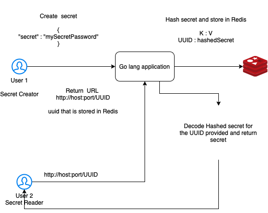

# **ots — Go lang app that helps in sharing a one-time secret password with anyone as a URL**

# **The application consists of two modules**

* ## server — go modules for rest api

* ## client — react js
